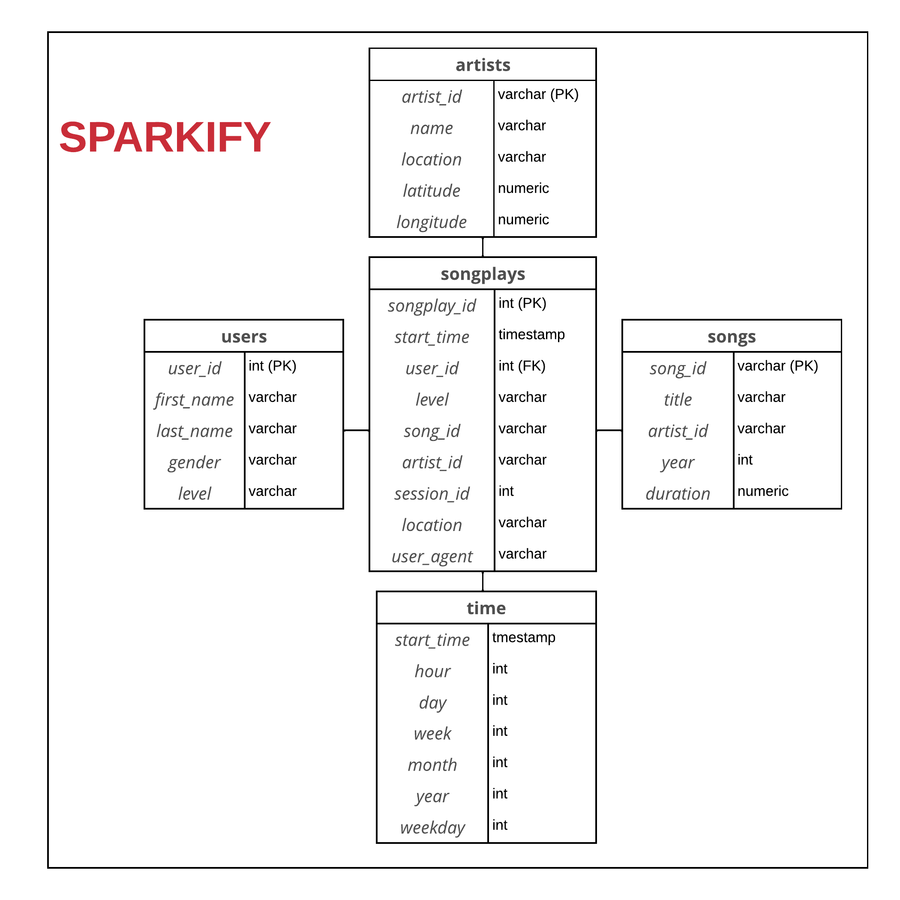

# Data-Modeling-with-Postgres
Applying data modeling with Postgres and build an ETL pipeline using Python. By defining fact and dimension tables for a star schema for a particular analytic focus, and writing an ETL pipeline that transfers data from files in two local directories into these tables in Postgres using Python and SQL.

## Files:
1. `test.ipynb` displays the first few rows of each table to let you check your database.
2. `create_tables.py` drops and creates your tables. You run this file to reset your tables before each time you run your ETL scripts.
3. `etl.ipynb` reads and processes a single file from song_data and log_data and loads the data into your tables. This notebook contains detailed instructions on the ETL process for each of the tables.
4. `etl.py` reads and processes files from song_data and log_data and loads them into your tables. You can fill this out based on your work in the ETL notebook.
5. `sql_queries.py` contains all your sql queries, and is imported into the last three files above.
6. `helpers.py` some python functions to be used on the other files.
7. `db_config.yml` data base configuration fields.

## Project Steps
### Create Tables
1. Write CREATE statements in `sql_queries.py` to create each table.
2. Write DROP statements in `sql_queries.py` to drop each table if it exists.
3. Run `create_tables.py` to create database and tables.
4. Build ETL in `etl.ipynb` and `etl.py`
5. Run `test.ipynb` to conf after each step to run Sanity Checks.

## Schema:
**Star schema**
### Fact Table
1. **songplays** - records in log data associated with song plays i.e. records with page `NextSong`
   - songplay_id, start_time, user_id, level, song_id, artist_id, session_id, location, user_agent
### Dimension Tables
2. **users** - users in the app
   - user_id, first_name, last_name, gender, level
3. **songs** - songs in music database
   - song_id, title, artist_id, year, duration
4. **artists** - artists in music database
   - artist_id, name, location, latitude, longitude
5. **time** - timestamps of records in songplays broken down into specific units
   - start_time, hour, day, week, month, year, weekday

